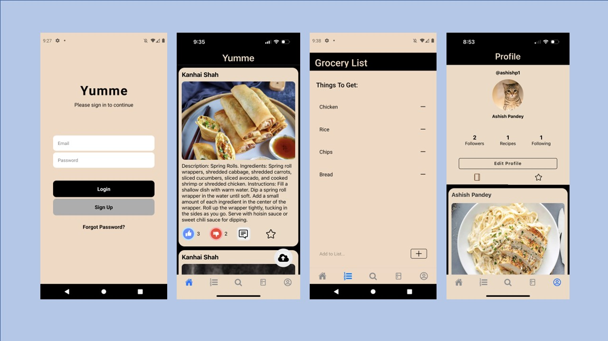

<h1 align="center">
  YUMME
  <h4 align="center">A recipe recommendation app.</h4>

<p align="center">
  <a href="#key-features">Key Features</a> •
  <a href="#how-to-use">How To Use</a>
  
</p>

<br>

<p align="center"></p>

<br>

## Key Features

- Firebase Authentication
  - New user creates they will need to verify their email address
- Recipe Social Media Feed
  - users can post, rate, comment and save recipes
- Grocery List
  - Users can add or delete ingredients from the grocery list and share the list with other users
- Virtual Kitchen
  - Users can add, delete and update ingredients they have at home
- Recipe Search
  - Users can search for new recipes or be recommended new ones based on the ingredients in their virtual kitchen
- Cross platform
  - Android and iOS ready.

<br>

## How To Use

To clone and run this application, you'll need [Git](https://git-scm.com), [Node.js](https://nodejs.org/en/download/) (which comes with [npm](http://npmjs.com)) and and [Expo Go](https://docs.expo.dev/get-started/expo-go/) installed on your computer. From your command line:

```bash
# Clone this repository
$ git clone https://github.com/paetynrelich/Yumme.git

# Go into the repository
$ cd Yumme

# Install dependencies
$ npm install

# Run the app
$ npx expo start
```
